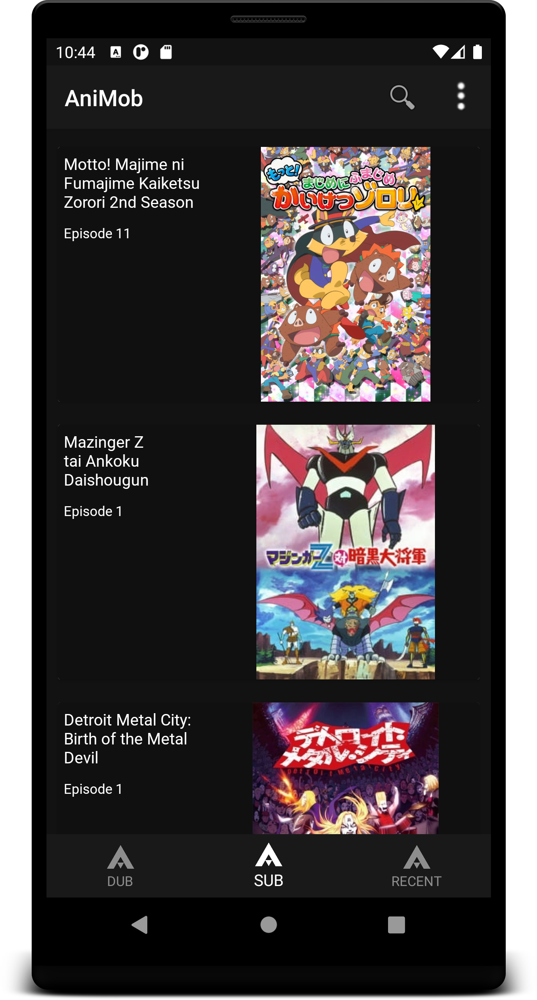
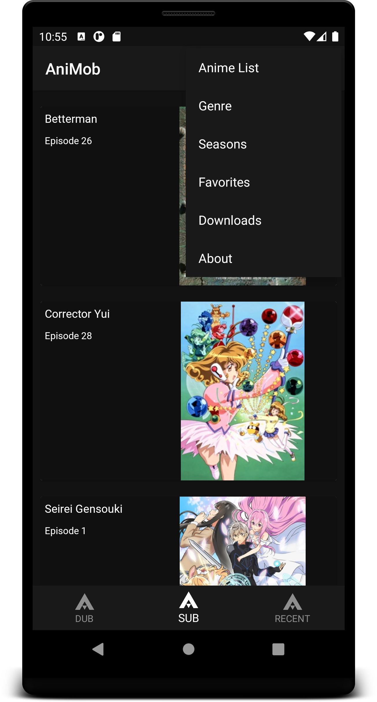
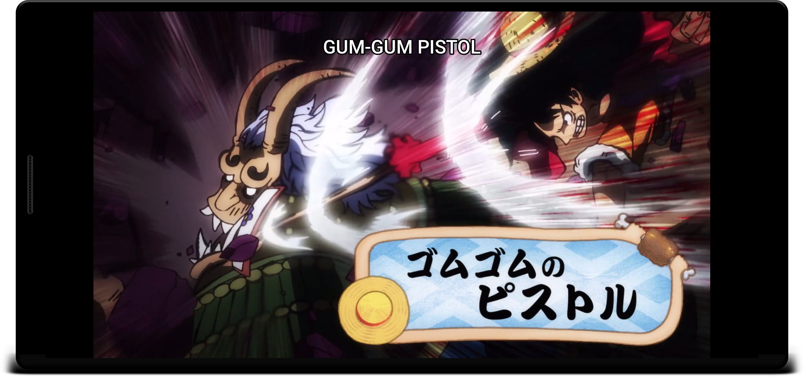

<h1> Animob</h1>

 A dark-themed App for watching anime at the best quality.

The episodes are directly scrapped an Anime website.

<h2>Features</h2>
<h3>Add to Favs</h3>

<h3>Watch Anime & Reactions </h3>

<h3> Watch Reactions & read Comments</h3>

<h3>Anime List</h3>

 Contains 6142 Anime (Updated on daily bases)

   
  
  

